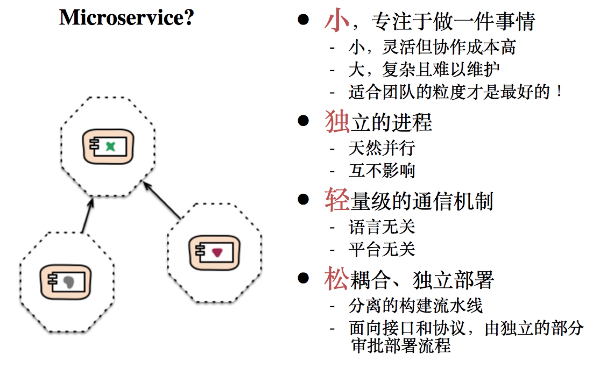
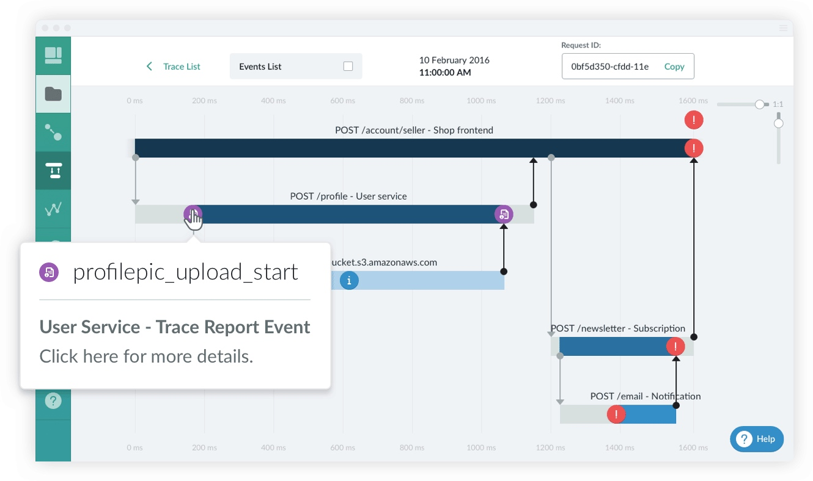
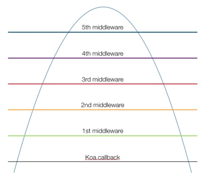
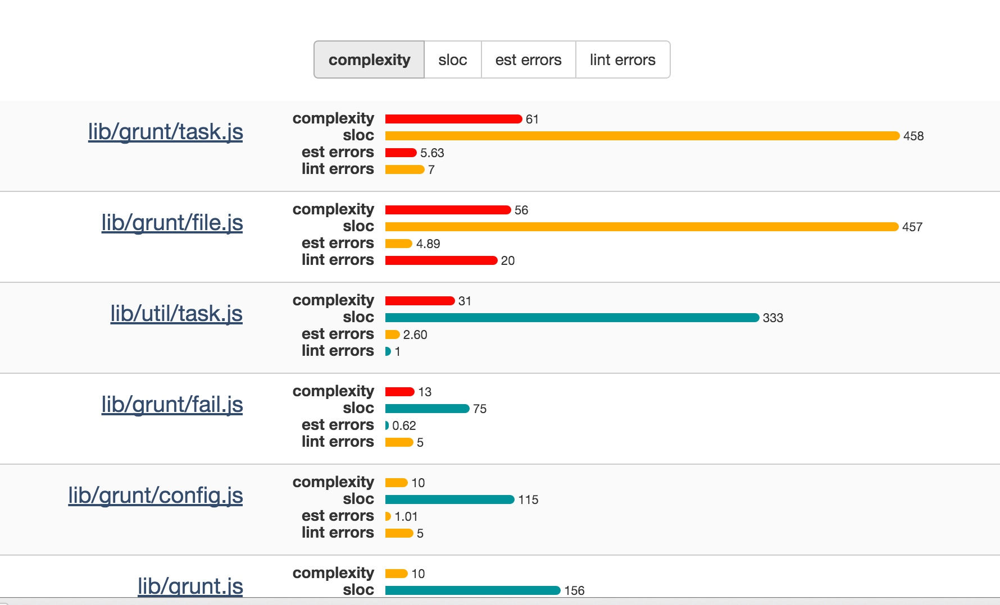

## Node.js 在广发证券：koa2 和 微服务实战新一代API Server

### 自我介绍

- 豌豆荚 - WebApp
- 广发证券 - Hybrid App && Node.js 开发
- [我的博客](https://github.com/gaohailang/blog) （一些技术上的思考和分享）

```note
前几位的分享都特别棒，在今天的活动的尾声我给大家带来的topics是讲述我们广发证券这样一个传统券商在新技术Nodejs的一些使用尝试的经验教训的。

先来个简单的自我介绍：我毕业前在百度实现做前端开发的一些工作，临近毕业突然觉醒想去创业公司去试试就到了豌豆荚一直从事公司的商品产品如开发者中心，集成了应用上传，游戏联系，广告投放管理和IAS接入，openAPI等等。去年开始从北京到深圳（原因你们都懂得），发现这边真是除了贵腾讯好像没有什么又大又好公司了，偶然的机会再拉钩上看到酷炫的xxx，一下子就被吸引了（虽然xxxx


```

### 分享大纲

* 为什么我们这么玩
* 我们和开源
* 我们对 Node.js 的定位
* API Server 和 Node.js
* 微服务 和 Node.js
* Koa2 和 Node.js
* 日常开发 与 Node.js
* Web 开发 和 Node.js

```note
今天我要分享的agenda大致是：
是从上到下，从云到node的讲解，从新node讲到就node，从node将会普通web开发
```


### 为什么我们这么玩

#### How - 我们是怎么做的

- 金融创新


- 技术前沿（bleeding - edge）


```note
去看我们的一些技术选项前，先看看我们是什么样的组织，再看看我们对开源技术的态度，这样才能得出一些背后的原因，也给你们一些技术参考。

不过新等等，
最早运用这些技术框架开发复杂运用的公司了（金融？
和大家想的一样，为什么一个传统券商，会在技术上这么有追求呢，你们的IT产品和需求不都是外包的吗？
那你们为什么还放出这样的广告『证券行业创新高涨，国际化进程中，投行等』
```


#### Why - 为什么这样的技术选型

- 吸引爱玩技术的你们
- 解决问题弯道超车
- 形成学习型组织


```note
为什么这么做了，激进的采用这样的方式，首先业务上（我是较高复杂度的譬如购买一个理财产品很多逻辑的判断和，流量上的倒不是很大，但业务上流动的钱到时候百千万到亿的~，其次我们推崇的微服务就允许让我们xxx（因为它xxx
最终还是招到人：
3点

这里就引入了我们今天的主角：Node.js，我们可能是金融行业乃至是互联网用这些技术开发复杂应用的团队了。 
```


### 我们和开源

- ES6
- Angular2
- 更多见Blog，我们的技术分享


```note
所以从去年开始，开源上的做了一些工作：
我们团队大神在去年去QCon上海在将我们在es6上的一些前沿实践（业界也有我们es6-style-guide，可以再参考）
同时去去年尾声开始在angular2上写书准备，翻译了官方的guide，所以我们收到Google官方的邀请让我们推动ng2在国内文档化的工作。
更多的一些技术分享，可以在我们的github repo中看到
几个小图，从大变小的animation？！


广告这么长，背景，接下来我们切入进来了正题：
可以看到正是我们在技术上的尝试，使得我们在node及其相关的技术选型形成来今天的风格，这是背景大家可以参考和对比。
```


### 我们对 Node.js 的定位

#### 我们的技术全景图


#### 和微服务架构结合


```note
首先看下我们的全景图xxx，
从泛终端作为入口，到我们的云端edge，对接micro services，后面有中间件和大数据backup，最终对标交易平台。

在我们的云端edge就大量使用着node。js来做它适合做的事情，甚至一些对性能不那么苛刻的微服务也有js来构建的（如果解决好类型等开发复杂应用稳定性

从接入层之后到柜台之前都变微服务
	•	原子化服务 – 细粒度、独立部署、独立维护升级、独立扩容 
	•	所有服务内置平台层、应用层监控(Google Dapper类技术)
• 金管家、金钥匙、易淘金、开户系统。。。功能拆分、微服务容器、云化 
• 应用层“聚合” – 不同应用场景聚合不同的微服务 


可以看到我们的架构中（接入层和微服务，原子化，场景化聚合）
（性能速度损耗，但是用户不care，可能被传统的金融银行等『惯坏』了，关于钱财的还是别轻飘的好
```


### API Server 和 Node.js

#### 不同时代的Server

- backend page 
- simple restful（or db access）
	- restful extend
- API Server 新方向
	- graphql & falcor

#### RESTful

- Optional-Field
- Filter & Sort
- Pagination
- Bulk Inserts
- Embedded & Sub Resource


```note

几层的RESTful成熟度模型

Hekru 提供的指南。

/people?where={"lastname": "Doe"}
/people?sort=city,-lastname
?sort=[("lastname", -1)] - mongodb style

/people?projection={"lastname": 1, "born": 1}

/comment/?embedded={"author": 0}

$ curl -d '[{"firstname": "barack", "lastname": "obama"}, {"firstname": "mitt", "lastname": "romney"}]' -H 'Content-Type: application/json' http://eve-demo.herokuapp.com/people

看起来每个开发者最后都会疑问那么关于API接口呢？很多人会直接想到RESTful API（因为太流行了），同时SOAP真的成为过去式了。同时现在也有不少其他标准如：HATEOAS, JSON API,HAL,GraphQL 等

```


#### API Server 新方向

- GraphQL & Relay
	- https://github.com/RisingStack/graphql-server
- Falcor


```note
GraphQL 赋予客户端强大的能力（也是职责），允许它来实施任意的查询接口。结合Relay，它能为你处理客户端状态和缓存。在服务器端实施GraphQL看起来比较困难而且现有的文档大部分是针对Node.js的

网飞(NetFlix）的Falcor 看起来它也能提供那些Relay和GraphQL提供的功能，但是对于服务器端的实现要求很低。但现在它仅仅是开发者预览版没有正式发布。
```

#### 关于聚合

- batch fetch
- ql.io


```note
所有这些有名的标准规范有他们各种的奇怪之处。一些是过于复杂，一些只能处理读取没有覆盖到更新接口。一些又严重和REST走失。许多人选择构建它们自己的，但是最终也要解决它们设计上带来的问题。

我不认为现在有什么方案是个大满贯（完美的），但是下面是我对API应该有的功能的一些思考：

It should be predictable. Your endpoints should follow consistent conventions.
It should allow fetching multiple entities in one round trip: needing 15 queries to fetch everything you need on page load will give poor performance.
Make sure you have a good update story: many specifications only covers reads, and you’ll need to update stuff sometimes.
It should be easy to debug: looking at the Chrome inspector’s network tab should easily let me see what happened.
It should be easy to consume: I should be able to easily consume it with fetch, or have a well supported client library (like Relay)
我没有找到能覆盖这些需求的方案。如果有，务必让我知道。
同事考虑，如果你实施一个标准化的RESTful资源路径时，使用Swagger来文档化我们的API

```

### 微服务和Node.js

#### 什么是微服务




加入之前的文章  https://github.com/gf-rd/blog/issues/10

需要在一些节点加上agent，实现动态扩容等(mind shift from 机器性能到集群扩展容，随时挂掉预设）

公司整理的一些规范：

- docker化（见指南
- 无状态。从而方便Kubernets扩缩容或调整机器资源（重启等），或者有状态恢复机制
- 环境变量配置优先（配置项通过env传入，如数据库，redis等
- 不要使用卷映射（如logs文件通常打到console中，然后fluentd传入大数据（走kafka; node_modules ADD file 到docker中
- 提供健康检查脚本(见指南)


#### 微服务集成开发

- docker 部署
- 无状态（随时被动态扩缩容掉
- request监控（链路追踪
- 配置加载管理（环境变量

```note
那么我们想实践微服务，node.js web上需要做哪些工作了？

```

##### Docker 部署

学习 Docker 容器相关 - https://github.com/gaohailang/blog/issues/13


```note
现在不少公司通过docker来弯道超车，解放了运维和开发的环境搭建和服务部署的老大难问题，甚至也初步具有的云计算的能力。所以我们需要在node项目中集成docker发布等工作。 脱离原来的gulp/grunt脚本，我们利用更加轻量的npm scripts来实施我们的构建工作。

npm run rsync:gftest 把现有构建后的es5代码同步到内部的测试机器上，用于内部测试和部署。

npm run restart 用于重启docker，传入配置文件（如外部api通过环境变量文件导入等）

npm run docker:build 通过 Dockfile 构建 docker 镜像

npm run docker:push 推送构件号的 docker 镜像到公司私有的docker中央服务器上

```

##### request: 监控和debug

```js
require('request-debug')(rp, function(type, data, r) {
  // put your request or response handling logic here
  // Todo: request-post data lost? response json.stringify broken?
  if(type === 'request') {
    var {debugId, uri, method, body} = data;
    var userId = data.headers.userId;
    var more = body ? '' : ('-'+body) + userId ? '' : ('userId:'+userId);
    debug(`${debugId}-${method}-${uri}` + more);
  }

  if(type === 'response') {
    var {debugId, statusCode, body} = data;
    debug(`${debugId}-response-${statusCode}-`+JSON.stringify(body).slice(0, 155));
  }
});
```


```note
我们的web应用接受请求，也发送请求。 我们需要对这些请求进行记录和追踪，这样才能对一些用户的具体操作进行trakc甚至replay来辅助我们debug用户的线上问题，对我们依赖的外部微服务的状态和返回数据进行审视和使用杜绝可能存在的外部broken或者不符合预期的返回搞挂我们的应用。

基于morgan 对请求的track

如默认的morgain支持一些预设计的format，但是发现不能满足我们的一些需求：

如日期不够直观
如希望打印出gfUid 信息（cookie 通过我们前置的nginx & openresty lua脚本替换为广发通id)
如对一些信息的关注（如状态码，请求响应时间等
var Morgan = require('koa-morgan'), logger;

// https://github.com/expressjs/morgan
Morgan.token('gfUid', (req, res)=> req.headers['UserId']);
logger = Morgan(':remote-addr [:date[iso]] ":method :url" :status :res[content-length] :response-time ms gfUid: :gfUid ":referrer" ":user-agent"');
// const logger = Morgan('combined');

module.exports = logger;
基于request-debug 对于外部接口的track

request 这个类库本身已是用tj的debug模块来debug的，所以在开发的时候可以开启（）但是过于verbose，我们可以利用request-debug来定制化实现我们的追踪工作（该类库重写了request方法，在请求生命周期的多个hook点emit出事件出来。
```

##### request :链路追踪

- zipkin？！全链路监控 @ Google
- Trace is a visualised stack trace platform designed for microservices. http://trace.risingstack.com




##### 配置加载&环境变量

关于配置我们集成了confit和shorthandle（来自paypal）。

- 各种 handler
- 基于不同环境实现差异化配置
- 根据env变量自动加载

```js
// envfile
GFWC_storeExShopList=http://shopdev.gf.com.cn/api/store/shop/excellentshop/{id}/{page}/{size}
GFWC_storeSpShopList=http://shopdev.gf.com.cn/api/store/shop/special
GFWC_userFavShopList=http://shopdev.gf.com.cn/api/store/auth/favorites/shop/inorg

// 配置：
{
  "env": "development",
  "api": {
    "articleSearch": "env:GFWC_articleSearch",
    "shopSearch": "env:GFWC_shopSearch",
    "stockSearch": "env:GFWC_stockSearch",
    "portfolioSearch": "env:GFWC_portfolioSearch"
  }
}

```


### Koa2 与 Node.js

#### What

- 何时发布
- 哪些改动

```note

This proposal was accepted into Stage 3 ("Candidate") of the ECMAScript spec process in September 2015. The champion intends for this proposal to be accepted into Stage 4 ("Finished") by the end of November.
https://tc39.github.io/ecmascript-asyncawait/

* koa2中 的 es7 什么时候 release
	大家应该会特别关心，koa2 发布了吗，你们敢用一个未发布的xxx，事实上（issues中说的那样xxx）

- 我们准备等到async/await正式被node.js实现后才发现稳定版的koa2。需要你的应用服务器需要babel才能运行不是一件好事（从
  开发体验上。我目前就是这么做的不过遇到些问题。然而在书写中间件时大量单纯使用Promises或者用co()火
  Bluebird.coroutine()包围各种代码也不是什么好体验。最佳的方式还是等2a被原生支持后那样书写中间件才好
- 你可以在这里（chromium v8 关于2a的bug
  看到v8实施2a的进展。一般在v8实现async函数后，需要些时间等该v8版本迭代稳定（一般大概6周吧），然后需要更多时间集成该版本的v8的
  nodejs发型稳定版（一般是每6个月一次大版本升级
    - https://bugs.chromium.org/p/v8/issues/detail?id=4483
    - 『Microsoft Edge's JS engine, ChakraCore, was just opened source
      and is now node.js compatible, allowing async/await support in
      node.js.』 -
      https://github.com/Microsoft/ChakraCore/tree/master/test/es7
- 所以等v8实现a2后，一般会需要2-7个月发布稳定版的koa2（一般只需要一天时间，因为没什么就是中间件的签名变了
- 不要害怕，现在就可以开始使用（借助发布前的babel，很多人已经在生产环境中使用它了，我们也不在会未来改什么API

```

#### Why

- 1 NIO 同步写法
- 2错误处理
- 3 中间件
    - response-time 展示

```note
（比起generator更直白，需要wrap，co，next 这些是什么鬼？！）
```

##### 同步代码

一些例子展示（从search.js等中摘取

```js
  var {storeUserInsInfo, storeLatestInfo, storeHotInfo} = apiConf;
  var {externalInfo, portSelfInfo, portSelfStocks} = apiConf;
  
  ## externalInfoFetch，storeInfoFetch等都是用于规整请求的入参
  
  router.get('/opt-auth/pickup', async (ctx, next)=>{
    var userId = ctx.request.get('userId');
    var reses = await Promise.all(_.map([
      externalInfoFetch('ZCCJTT'), // 外部精选资讯
      storeInfoFetch(storeLatestInfo),
      storeInfoFetch(storeUserInsInfo, userId)
    ], (opt)=>{
      return rp(opt);
    }));
    ctx.body = {
      "external-headline": reses[0],
      "store-latest": reses[1],
      "store-myinterest": reses[2]
    };
  });
```

##### 错误处理

```js
// error handler to JSON stringify errors
const errorRes = require('./middleware/error-res');
app.use(errorRes);

module.exports = async function(ctx, next) {
  try {
    await next();
  } catch (err) {
    if (err == null) {
      err = new Error('Null or undefined error');
    }
    // some errors will have .status
    // however this is not a guarantee
    ctx.status = err.status || 500;
    ctx.type = 'application/json';
    ctx.body = {
      success: false,
      message: err.stack
    };
    ctx.app.emit('error', err, this);
  }
};

// 用于关闭前的一些处理如保存数据，记录错误，发送邮件等等
process.on('uncaught', ()={});
```

```note
callback: domain, 异步错误需要next(err)，同步异常的try-catch等， domain被废弃掉，app.use((err, req, res, next))的忽略
所以顶层的try-catch 的放置顺序
```


##### 中间件写法

```js
function responseTime() {
	return async(ctx, next) => {
	  var start = Date.now();
    await next();
    var delta = Math.ceil(Date.now() - start);
    ctx.set('X-Response-Time', delta + 'ms');
	}
}
```

```note
要知道得益于koa的回形针的写法，而不用像之前express那样，曲折

```


#### 我们的koa中间件

	- 常见的middleware
	- compose koa
	- koa-adapter （常见中间件的引入）
	- 文件即路由
	- koa-validator

```note
* koa2那些中间件和扩展（罗列出来围绕 koa2）
```

##### 常见middleware


##### koa composite


```js
function compose(middleware){
  return function *(next){
    if (!next) next = noop();

    var i = middleware.length;

    while (i--) {
      next = middleware[i].call(this, next);
    }

    return yield *next;
  }
}
```




##### koa adapter

## 兼容koa1.x的中间件 - [koa adapter](https://github.com/th507/koa-adapter)

把es6的generator和yield的变成es7的async/await写法

```js
// koa-logger@1 only support koa@1
const logger = require("koa-logger")

// use legacy middlewares with adapt(...)
app.use(adapt(logger))
```

##### 文件即是路由

```note

```

##### Valiate

```js
// 关于请求的入参验证
ctx.checkQuery('query', 'Invalid query').notEmpty();
ctx.checkQuery('type', 'Invalid type').
    isIn(baseSearchTypes.concat(['all', 'stock']));
    
function assertPagintionQuery(ctx) {
  ctx.checkQuery('page', 'Invalid page').notEmpty().isInt();
  ctx.checkQuery('size', 'Invalid size').notEmpty().isInt();
}

/*
  关于数据模型的验证
  mongodb 本身是schema-less，但这并不意味着我们容忍脏数据的随意插入（只是方便我们修改和扩展数据Schema，方便业务发展）
 */

 var joiUserSchema = Joi.object({
     name: Joi.object({
         first: Joi.string().required(),
         last: Joi.string().required()
     }),
     email: Joi.string().email().required(),
     bestFriend: Joi.string().meta({ type: 'ObjectId', ref: 'User' }),
     metaInfo: Joi.any()
 });
```


### 日常开发 与 Node.js

- es6
- npm scripts
- 性能调优
- 上线准备
- 安全

#### ES6化

##### 逐渐迁移legacy 代码

```js
// before

// after
var {pgae, xx} = req.query;

```

##### Babel 集成


```json
{
  "presets": ["es2015-node5"],
  "plugins": [
    "transform-async-to-generator",
    "syntax-async-functions"
  ]
}


```

```note
之前有些人吐槽说babel改过后，代码xxx，反正我们是没有遇到，代码不够复杂？！
其实
确保你的基础node版本不小于5.6，使用 npm install 安装依赖。npm start 启动该脚手架。 Tip: 使用node 5确保我们的babel transpile 可以尽量让产出的代码精简 (.babelrc 中的preset为 es2015-node5)

你会发现使用 similiairty 去跑没啥差别

部署es6代码用于线上生产（先构建好 es5-compatible ）
```

babel 编译和上线
eslint

#### npm scripts 构建过程

https://github.com/gf-rd/blog/issues/20
* npm scripts 使用 - 去掉多余的gulp
* npm 的一些hook点

- 及时更新依赖
- file watch
- 入库前检查
- 代码质量检查

```note
现在的一大趋势，是把多余的Gulp也好，Grunt也好，去除掉
为什么？因为npm本身提供很好的脚本支持，它不需要都与的gulp wrap，直接引入了你需要的工具如（xx），通过灵活的hook来做一些构建task的设置

那我们看看用它可以具体做什么事情，我们又是怎么做到的
```

##### 及时更新的依赖


```note
left-padding的那坨事
https://github.com/dylang/npm-check

```

##### file watch


```json
{
  "main": "index.js",
  "scripts": {
    "dev": "nodemon --exec babel-node -- $npm_package_main"
  }
}
```

```note
我们当然也可以通过pm2来设置，看个人喜好。为他配置一些需要ignore的目录，然后自由编码去吧
nodemon  Simple monitor script for use during development of a node.js app.
```

##### 入库检查 


- npm run precommit : npm test
- npm run prepush : npm-run-all lint test test:deps
- npm run inspect : jsinspect


```note

```

##### 代码质量检查

- https://github.com/es-analysis/plato
- https://github.com/danielstjules/jsinspect (js smell 有截图)




```note
我们真的应该非常关注我们的代码质量，想想看对于关键代码如基础组件，核心业务功能等。

从 代码复杂度， sloc，eslint errors等等，关注

```


#### JS Smells 代码坏味道

- copy-paste
- repeat xxx

```note
todo: 从eslint臭一些rule，并且附上说明
刚才既然说到了，检查，还有一些代码需要复杂的eslint rule 来发现（甚至有些还不那么好发现）
具体文章请看。。。xxxx
看一些关键的copy-paste，
```

#### 在线上运行（Production Deploy & Security）

- 性能调优
- Express/Koa上线准备
- 安全

##### 性能调优

- [heap profiling](https://strongloop.com/strongblog/node-js-performance-heap-profiling-tip/)
- [内存泄露](https://strongloop.com/strongblog/node-js-performance-tip-of-the-week-memory-leak-diagnosis/)
- [CPU profiling](https://strongloop.com/strongblog/node-js-performance-tip-cpu-profiler/)
- [scaling proxies clusters](https://strongloop.com/strongblog/node-js-performance-scaling-proxies-clusters/)
- [event loop monitoring](https://strongloop.com/strongblog/node-js-performance-event-loop-monitoring/)
- [garbage collection](https://strongloop.com/strongblog/node-js-performance-garbage-collection/)


```note
我强烈推荐你们看strongloop（关于它和express那些事，link）出品的系列博文，看看如何优化。

- [ ] best practices for express in production, part two: performance
      and reliability 1119
- [ ] best practcies for express in production, part one: security

- [ ] tips for optimizing slow code in node.js 0107

```

##### Best Practices in Production 

- Use gzip compression
- Don’t use synchronous functions
- Use middleware to serve static files
- Do logging right
- Handle exceptions properly

```note


https://strongloop.com/strongblog/best-practices-for-express-in-production-part-two-performance-and-reliability/
```

##### 安全

- Don’t use deprecated or vulnerable versions of Express
- Use TLS （https）
- Helmet
- Use cookies securely
- Ensure your dependencies are secure
- 其他一些基础的：[security-checklist](https://blog.risingstack.com/node-js-security-checklist)

```note

https://strongloop.com/strongblog/best-practices-for-express-in-production-part-one-security/

https性能损耗


```

#### 其他（[Node] - 16年，新 Node 项目注意点）
  
  https://github.com/gf-rd/blog/issues/29
  
  - 异步函数支持回调惯例和Promise新写法
  - 智能的 .npmrc 和正确的版本管理做法
  - npm init
 
 
### Web 开发 和 Node.js

- 关于openresty & haproxy & varnish
- 关于 mongodb, redis
- 关于log，监控和指标计算
- 关于扩容，k8s
- 关于 kakfa 等

```note
Web开发不仅仅包括了应用Server逻辑本身的书写，我们还需要关注上下游的组件。

如帮助我们在接入层通过高性能的Lua脚本内嵌入一些代码逻辑（譬如把token切换广发痛Id，便于后语xxx）
譬如一些NoSQL数据库的使用。如文档性，k-v的redis等

- （画一个完成的链路图，把这些组件串联起来）
```


### 结束

#### 加入这场 FinTech Storm

```note
一起来玩：
撩开袖子开始动手吧，到我们这里玩node.js吧

没过瘾，来海岸城约饭交流，SCC 8 楼年终我们会有分享会，更深的技术交流还有金融业务知识
```


#### Reference

- [广发IT招聘](http://it.gf.com.cn)
- 广发RD Github Organization
- 广发技术Blog
	- 2016 Node
- Node.js 在广发实践（本次ppt）

```note
reference，罗列ppt中有的那些

```


#### 扩展阅读：


##### API Server

https://strongloop.com/strongblog/nodejs-loopback-deployd-api-serve/
Todo: 更新下新时代的 relay falcor 数据接口


the first three generations of API apps. 

Birth of API Server:
like Java's Sprint MVC or Struts. Rails, Django. sails, geddy - include a database abstraction (typically an ORM for RDBMS only), templating libraries for rendering HTML, and a base controller for gluing the two together.  但是 ajax 变多，客户端自己灵活的渲染模板， mvc based backend stretched to serve as both the web application and API server. controllers would implement some methods that returned an entire rendered page while some methods that would return data


the Thin Server:
with app app moving into client and an entirely separate api server. both could be thinned out. web app no longer could directly access the database - this access instead could be pased through to the client. frameworks and databases: MongoDB, CouchDB, Sinatra, Express, Deployd, Meteor and others.

making data on the wire the first class citizen. surfacing database style APIs to JSON document databases. by need data on the wire to transfer state to and from various data sources(database, backend services, etc)
client require much more from an API server. access to raw data is important, but clients require much more from an API server: data aggregation, security, validation, and denormalization are usually a requirement.


Optimized API Delivery:
一个pass-through的api 不利于大型项目的扩展，因为需要access to many data sources. 打包请求的特性让 building api simple is helpful. 但是把这些特定当做黑盒子让customization 实施起来很头疼。最终 REST 和 http 变成了api服务器的标准，但是should not dictate the design of our API server


打开黑盒子！！
Next generation API servers should provide all the out of the box features clients require, especially the hard parts, and provide hooks everywhere. 如 app.remoutes() API 返回 apis http routes, schema definitions, 和其他跟你api服务器相关的元数据信息用于 scaffolding client app, generating 文档，


Data Accesses:
大型项目使用很多数据源： databases, other REST APIs, proprietary services等  API server should provide an abstract API to these data sources that allow you to describe relationships and do ad hoc aggregation and filtering.
to define a list of access controls. 通过配置很容『now only the user that owns an account may read or write it』


Aggregation and Mashup:
聚合通过简单的 joining of data. (denormalize data from various sources, drop data into JSON document database)
譬如用户首页包括的数据可能 span many datasources. aggregated into a single document and easily fetched when homepage is loaded. 问题是 latent ahead-of-time denormalization. 可能会过期（ Java的 Teiid 来解决， without latent copying or moving data）- Loopback 中是 allows you to define relationships between data, even from distributed data sources, and request the aggregate data based on relationship.
如the product and product detail data could come from an inventory database, and the related products could come from a separate backend REST or even SOAP API.

curl http://api.myapp.com/api/products/42
 ? filter[include] = productDetails
 & filter[include]  = relatedProducts


REST:
treat REST as transport, 而不是编程模型。API server 应该跟容易实施 REST api. 不要和 http 混合了你的数据应该也可以通过 web sockets 去访问(just provide a client access to another protocol)


浏览器和移动端应用， 复杂度在增加， 需要更高级的 data acdess. several generations of API servers and frameworks has risen to meet this demand by supporting the requirement of these rich applications.
;

